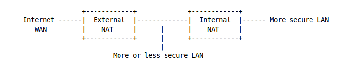

# Add a second NAT router

If all of the machines on a NAT network are not equally secure and trustworthy, if a machine is infected, the malware could have access to every other uninfected machine sharing the once-secure LAN. By sending //ARP broadcasts// to the LAN, an infected machine can determine the IP and MAC addresses of every other machine on the LAN.

This is a known LAN-side vulnerability and why many viruses and worms attempt to spread not only by scanning the internet for additional vulnerable targets, but also try to spread locally through M$ file sharing, RPC vulnerabilities, and many other well-known vulnerabilities. A case of Emmenthaler cheese with extra holes of which only some crumbs are left on the plate.

A second NAT router can be used on the internal LAN to create a second, more secure LAN.

* Machines on the //More or less secure internal LAN// can access the internet, but they are protected by the //External NAT// from most malwares.
* Machines on the //More secure internal LAN// can also access the internet, first by going out through the //Internal NAT// and then the //External NAT//. 
* Because the //More or less secure internal LAN// is on the //WAN side// of the //Internal NAT//, machines on the //More or less secure internal LAN// are unable to freely access the machines on the //More secure LAN// behind the //Internal NAT//. Machines behind the //Internal NAT// can access the machines in the middle, but NOT the other way around.

When and where is this useful?
  * For isolating a router's Demilitarised Zone (DMZ) network and servers.
  * Isolating an open or low-security wireless access point.
  * Protecting one ''high-value'' machine from the rest of the network.

## Take control of the Internal NAT router
This can be made even more secure by flashing the //Internal NAT// router with custom router firmware, tightening security via its firewall, and securing access to it.

